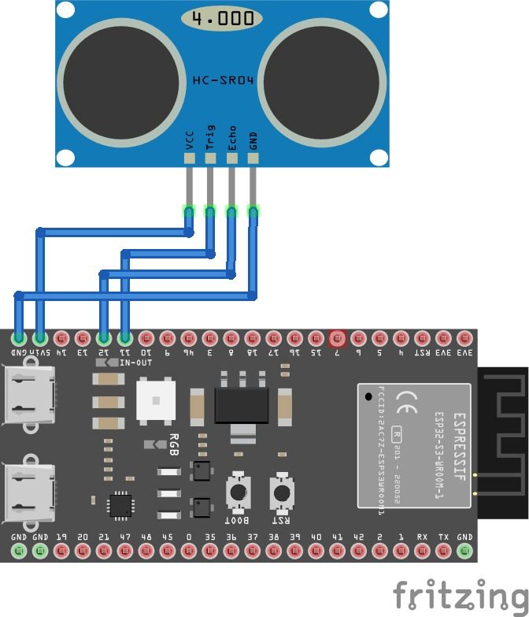

# TUGAS ETS TEKNOLOGI IOT
Kelompok : 6

Anggota  : 
- Siti Aisyah       (2042231008)

- Shelma Nur Sabila (2042231022)

# IoT Distance Monitoring System (HC-SR04, ESP32-S3, Rust, ThingsBoard, OTA)

## Deskripsi Project

Proyek ini bertujuan untuk merancang dan membangun **sistem IoT monitoring jarak** berbasis **sensor HC-SR04** dan **mikrokontroler ESP32-S3**. Sistem ini menggunakan **bahasa pemrograman Rust** di atas **sistem operasi Ubuntu**, dengan integrasi ke **ThingsBoard IoT Platform** untuk visualisasi data secara real-time, serta mendukung fitur **Over-The-Air (OTA)** update untuk pembaruan firmware jarak jauh.

## Langkah-langkah Implementasi

### 1. Persiapan Hardware dan Software

1.1 Siapkan perangkat berikut:
   - ESP32-S3 DevKitC
   - Sensor ultrasonik HC-SR04
   - Kabel jumper dan breadboard
   - Laptop dengan sistem operasi Ubuntu
   - Koneksi Wi-Fi

1.2 Instal Rust dan dependensinya di Ubuntu:
   - sudo apt update && sudo apt install git curl clang cmake libudev-dev
   - curl https://sh.rustup.rs -sSf | sh
   - rustup default stable

1.3 Tambahkan target ESP32-S3 dan toolchain:
   - rustup target add xtensa-esp32s3-none-elf
   - cargo install espup ldproxy
   - espup install
   
1.4 Verifikasi instalasi:
   - cargo build
   - rustc --version
   - idf.py --version

### 2. Rancang Bangun Sistem
2.1 Diagram Wiring

- **VCC → 5V**  
- **GND → GND**  
- **Trig → GPIO 5**  
- **Echo → GPIO 18**  

Pastikan semua sambungan kabel sesuai dengan daftar di atas dan gunakan **level shifter** bila diperlukan untuk menjaga kompatibilitas tegangan antara **HC-SR04** dan **ESP32-S3**.

2.2 Diagram Arsitektur

- **HC-SR04**: Mengukur jarak dengan memancarkan gelombang ultrasonik dan menerima pantulannya.  
- **ESP32-S3**: Memproses waktu pantulan sinyal untuk menghitung jarak dan mengirimkan data melalui Wi-Fi.  
- **Wi-Fi Network**: Menjadi media komunikasi antara mikrokontroler dan platform IoT.  
- **ThingsBoard**: Menerima data jarak dari ESP32-S3 melalui protokol **MQTT** dan menampilkannya dalam bentuk dashboard visual.  
- **OTA (Over-The-Air)**: Memungkinkan pembaruan firmware secara jarak jauh tanpa memerlukan koneksi kabel atau reprogram manual.  

### 3. Implementasi Program Rust

Struktur proyek terdiri atas:
   - main.rs
   - cargo.toml
   - beserta file pendukung yang dapat dilihat di folder 'code'

Seluruh program diatas sudah saya lampirkan di github dengan format .txt

### 4. Setup Thingsboard
Daftar di thingsboard.cloud via login Google, buka Entities > Devices > Add New Device, beri nama “ESP32-S3” dengan credentials MQTT (refresh Client ID seperti ’pe8qc3sr584qzm78ka8f’, username ’shelmais’, password ’shelma118’). Test koneksi di terminal Ubuntu dengan "sudo apt install mosquitto-clients" dan "mosquitto_pub -d -q 1 -h mqtt.thingsboard.cloud-p 1883 -t v1/devices/me/telemetry -i "pe8qc3sr584qzm78ka8f" -u "shelmais" -P "shelma118" -m "{distance:10}"". Lalu buat dashboard dengan widget Time-series untuk telemetry “distance” guna visualisasi data jarak.

### 5. Integrasi MQTT
Edit main.rs untuk tambahkan WiFi menggunakan esp-wifi (ubah SSID dan password). MQTT dengan rumqttc dependencies di Cargo.toml (tambah rumqttc, serde-json). Publish data jarak sebagai JSON ke topic “v1/devices/me/telemetry” setiap 2 detik dengan esp_println logging. Integrasikan inisialisasi sensor dan WiFi sesuai diagram alir (Mulai > Inisialisasi Sensor/WiFi/OTA > HC-SR04 Mengukur > Data ke ThingsBoard). Jalankan cargo build dan espflash flash –monitor hingga sukses meski ada error iteratif.

### 6. Implementasi OTA
Buat file buildota.sh dengan cargo build –release, flash.sh dengan espflash flash target/xtensa-esp32s3-espidf/project-iot –monitor, dan partitions.csv untuk partisi OTA di root proyek. Integrasikan ESP-IDF OTA component via esp-idf-sys di Cargo.toml. Konfigurasi web server HTTP port 80 untuk handle update. Generate .bin dengan ./buildota.sh (chmod +x jika error). Lalu update firmware via OTA sesuai diagram alir (Tunggu Interval > Periksa OTA > Proses Update Firmware OTA > Restart Sistem) dan diagram arsitektur (Rust Embedded > Device IoT > MQTT Connectivity > ThingsBoard).

### 7. Pengujian Sistem
Uji fungsionalitas pembacaan sensor (akurasi >95% via serial monitor), koneksi MQTT/WiFi (update real-time di ThingsBoard), dan OTA (update .bin versi 2 tanpa kabel via ./flash.sh atau web server) selama 24 jam
sesuai diagram alir lengkap (Mulai > WiFi Terhubung? > Pengukuran > Kirim Data > Periksa OTA > Update Selesai > Restart). Catat error dan iterasi di tabel sambil monitor anomali.

## Diagram Sistem

   
  <em>Gambar 1.0 Diagram Wiring ESP32-S3 dan Sensor HC-SR04</em>

   
  <em>Gambar 1.1 Diagram Alir Sistem</em>

   
  <em>Gambar 1.2 Diagram Arsitektur</em>

## Pembahasan Hasil

   
  <em>Gambar 1.3 Grafik Perbandingan Timestamp dan Realtime Clock</em>

## Kesimpulan

